# 📸 Screenshots Gallery

A visual walkthrough of the Inventory Management System API tested via Swagger UI.

---

## 🔐 Authentication

**Sign Up** — Register a new user account.

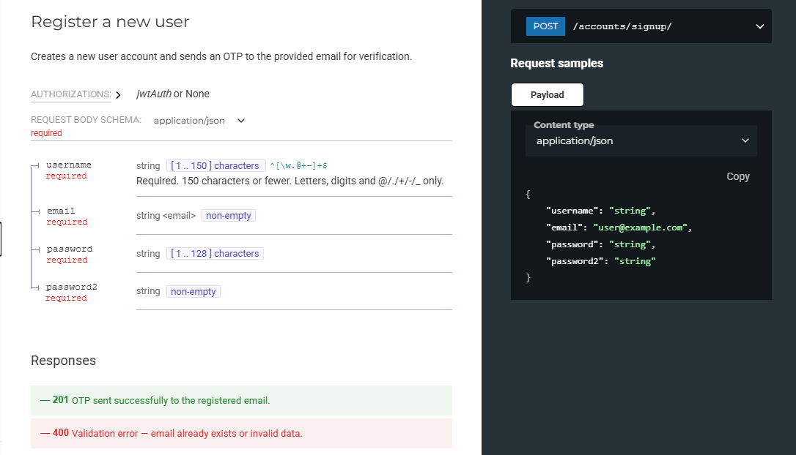

---

**OTP Request** — Request a one-time password sent to your email for verification.

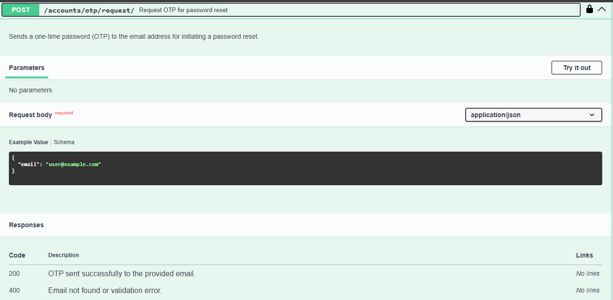

---

**OTP Verify** — Submit the OTP to verify your account and activate it.

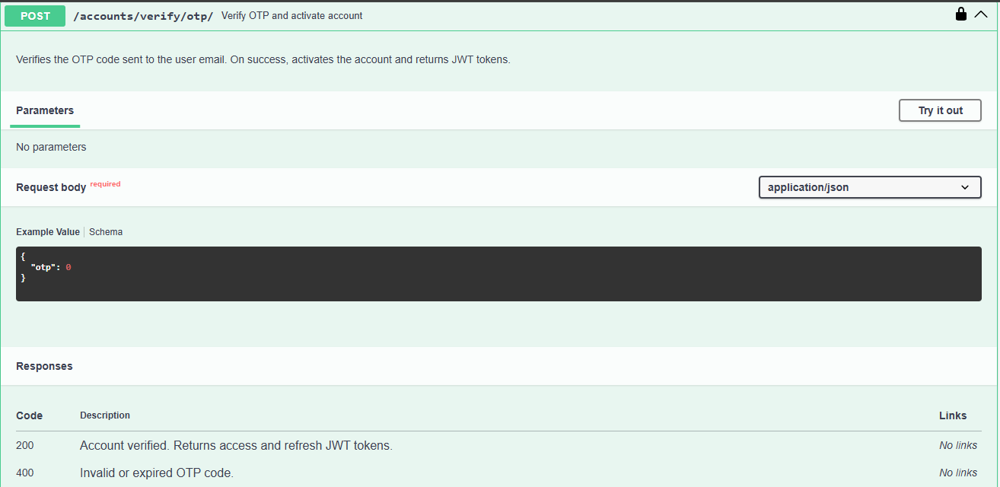

---

**Login** — Authenticate and receive JWT access and refresh tokens.

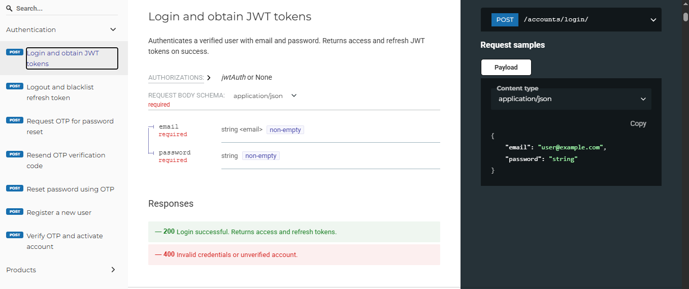

---

## 📦 Inventory

**Create Product** — Add a new product with SKU, pricing, stock level, and reorder threshold.

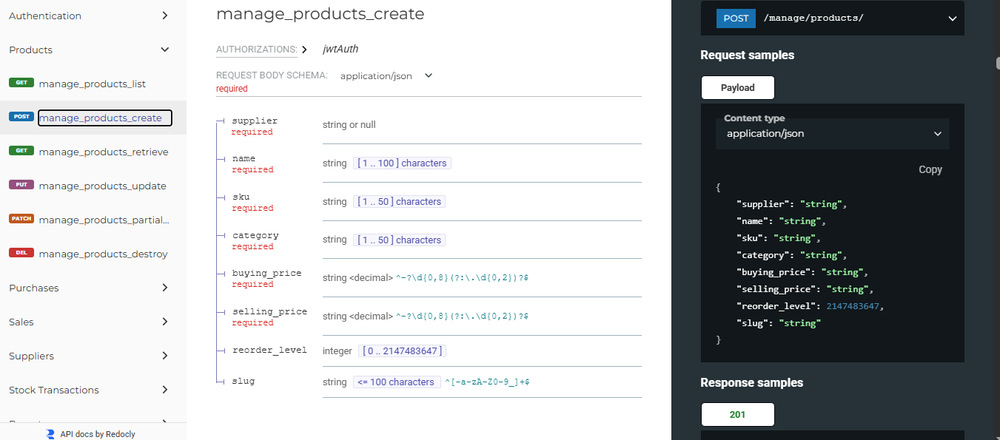

---

**Get Products** — Retrieve the full product list with filtering and search support.

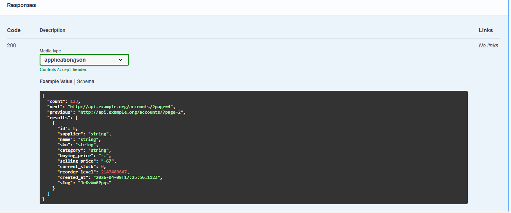

---

**Create Purchase** — Create a new purchase order for restocking a product.

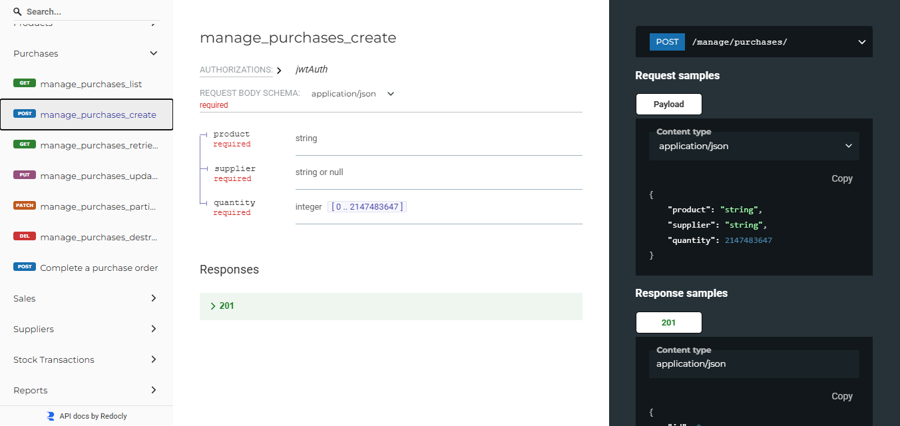

---

**Complete Purchase** — Mark a purchase order as completed, triggering a stock IN transaction.

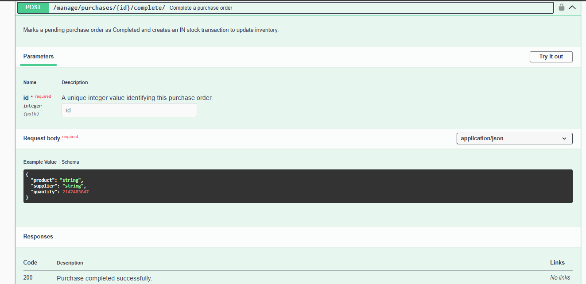

---

**Create Sale** — Record a new sale transaction with quantity and selling price.

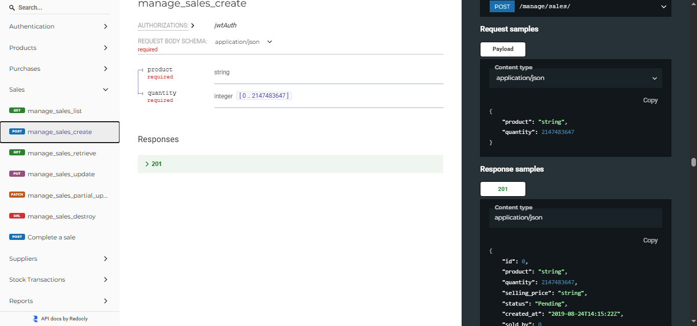

---

**Complete Sale** — Mark a sale as completed, deducting stock and recording the transaction.

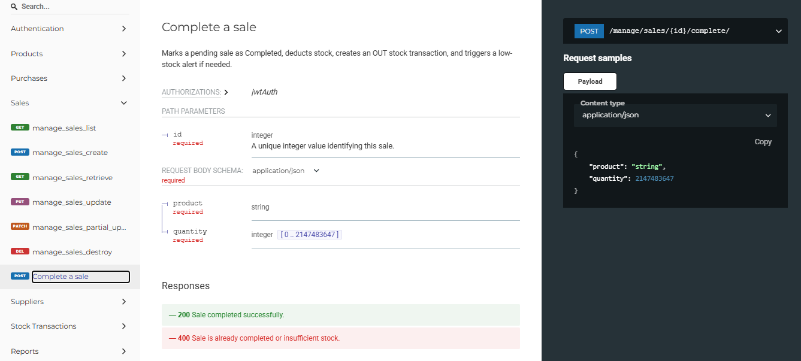

---

## 🔄 Stock Transactions

**List Transactions** — View the full stock transaction history (IN / OUT) for all products.

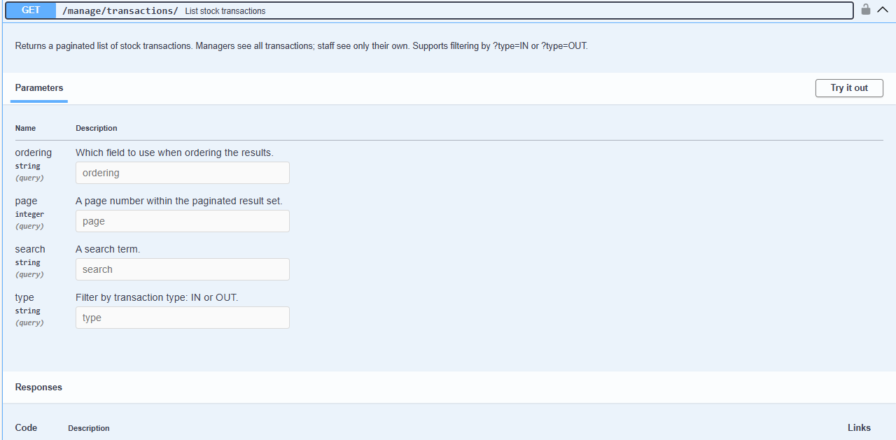

---

**Manager Create Transaction** — Managers can manually create stock IN or OUT transactions.

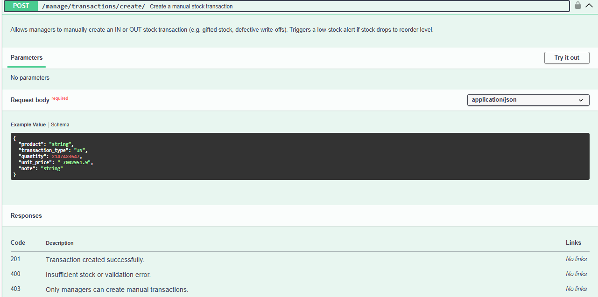

---

## 📊 Reports & Analytics

**Sales Report** — Summary of total sales volume, revenue, and optional per-staff breakdown.

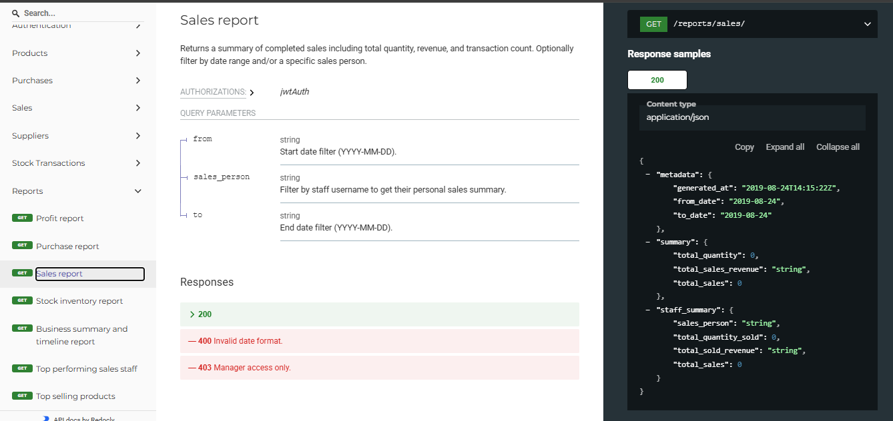

---

**Profit Report** — Revenue vs cost breakdown with gross profit and profit margin percentage.

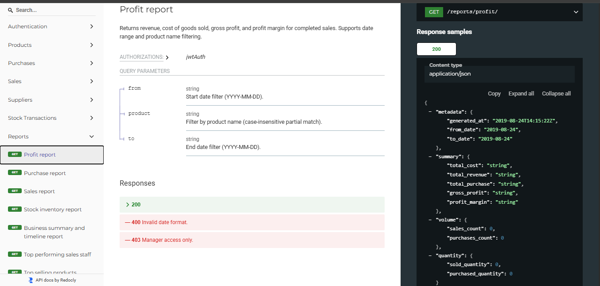

---

**Stock Report** — Full inventory snapshot showing in-stock, low-stock, and out-of-stock products.

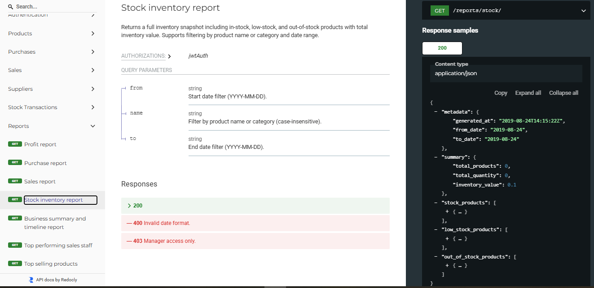

---

**Top Selling Products** — Ranked list of best-performing products by quantity, revenue, or transactions.

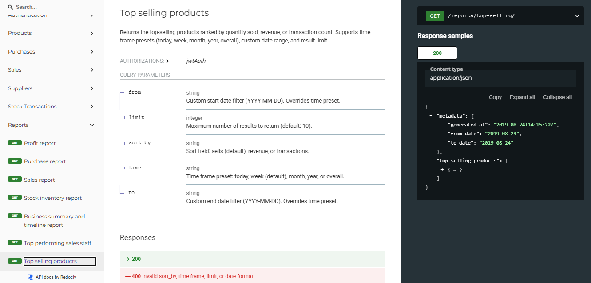

---

**Summary Report** — Overall business summary with profit metrics and a grouped timeline breakdown.

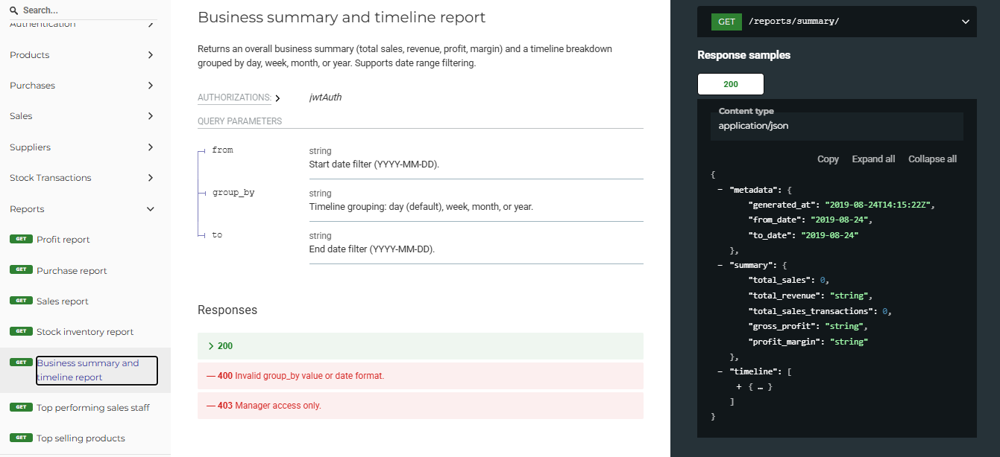

---

*Back to [README](README.md)*
